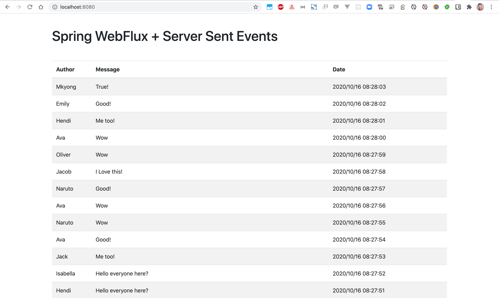

# Spring-Boot-WebFlux-Server-sent-events-example
### Things todo list:
1. Clone this repository: `git clone https://github.com/hendisantika/Spring-Boot-WebFlux-Server-sent-events-example.git`
2. Go inside the folder: `cd Spring-Boot-WebFlux-Server-sent-events-example`
3. Run the application: `mvn clean spring-boot:run`
4. Open your favorite browser: http://localhost:8080

### Image Screen shot

Home Page

